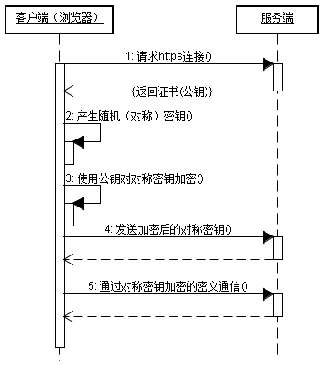

## HTTP Versions

### 结构

### HTTP/0.9

- 仅GET方法。
- 无请求头部
- 只能响应HTML格式。
### HTTP/1.0
- 引入POST、HEAD方法。
- 添加了请求头（http header）。
- 一次一个请求，请求完自动关闭。需要`Connection: keep-alive`保持连接。
- 还有状态码（status code）、多字符集支持、多部分发送（multi-part type）、权限（authorization）、缓存（cache）、内容编码（content encoding）

#### Content-Type文件格式。

​	`格式MIMEType`：*type/subtype;[paramet=value]*[^media type]

​			`type`：discrete type（single file） 和 multipart （多个文件组成）

​					`discrete type`:	如：text/plain；image/jpeg；audio/mp4；video/mp4；application/pdf…；

​					`multipart`: 如 message/rfc822 ；multipart/form-data[boundary=STRING]；multipart/byteranges；

#### Content-Encoding 压缩方法

​	`Content-Encoding`：服务器端返回内容格式。 gzip/compress/deflate；

​	 `Accept-Encoding`：request通知服务器接受的内容。如：Accept-Encoding:gzip,deflate。

#### Content-Length 当keep alive时方便判断下一个请求头位置。

### HTTP/1.1

- 持久连接。自动keep alive；被动关闭：一段时间无请求则关闭；主动关闭 Connection:close;
- 管道（pipeline）：multiple [HTTP](https://en.wikipedia.org/wiki/HTTP) requests are sent on a single [TCP](https://en.wikipedia.org/wiki/Transmission_Control_Protocol) (transmission control protocol) connection without waiting for the corresponding responses。
- `Chunked transfer encoding`last-chunk：请求response结束位。[^chunked transfer encoding]
- 引入PUT HEAD OPTIONS DELETE PATCH CONNECT TRACE
- 引入Host。http/1.1必传，否则返回400。使1个IP下有多个服务器。
- ["队头堵塞"](https://zh.wikipedia.org/wiki/队头阻塞)（Head-of-line blocking）

### HTTP/2

- 二进制协议。协议头也可以是二进制。
- Multiplexing（多工/多路复用）。
- 数据流。不同于`chunked transfer encoding`机制。通过每个包都有一个ID区分哪个请求。可以中断单个流；指定流优先级。
- 头部压缩。
- 服务端推送Server Push。

---

[^media type]: https://developer.mozilla.org/en-US/docs/Web/HTTP/Basics_of_HTTP/MIME_types
[^chunked transfer encoding]: wiki：https://en.wikipedia.org/wiki/Chunked_transfer_encoding

