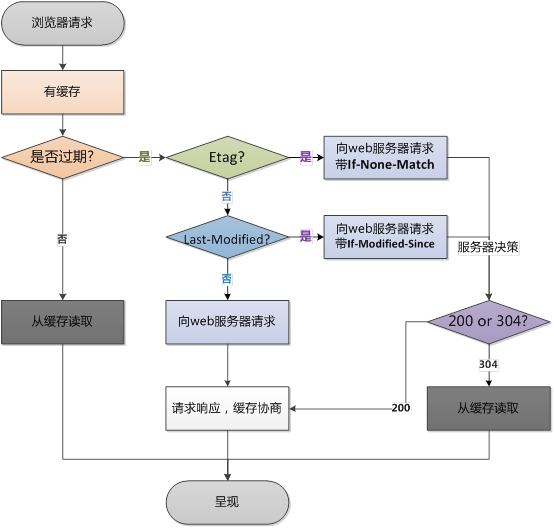

# :HTTPCache:

### :缓存:

http缓存分为`强缓存`和`协商缓存`

#### 强缓存：

命中`强缓存`则不需要去服务器请求数据。

> 1. 通过`Expires`和`cache-control`两个字段控制。
> 2. `cache-control`优先级高于Expires。
> 3. 强缓存命中后chromeReques请求详情里中size会显示为（from cache[^cache]）。
> 4. F5:会绕过强缓存；Ctrl-F5绕过所有缓存。
> 5. `Programa`http 1.0 版本。

**Cache-Control：**

http1.1协议。
格式：`Cache-Control`: *EXPRESSION*  

> *EXPRESSION*:
> 
> 1. `max-age`:(max-age=X)有效期为多少秒。
> 2. `public/private`: 被所有节点（代理）/用户节点（浏览器）缓存。
> 3. `no-cache`:内容会缓存，但每次用都需要去服务器验证。与max-age=0区别，max-age是should，no-cache是must去revalidate。
> 4. `no-store`: 内容不缓存.
> 5. `s-maxage`: 仅共享缓存有效。权限高于max-age。

**Expires**

http 1.0协议

> 格式：`Expires`：时间点[^时间格式]。
> 
> > 1. 使用的相对时间。如果本地时间错误，则比较可能失效。所以需要被max-age替代。

#### 协商缓存：

如果绕过强缓存，则去服务器校验缓存。
主要通过服务器和文件时间（Last-Modify/If-Modify-Since）和文件签名（Etag/If-None-Match）；

> 1. Last-Modify精确到秒；E-Tag可以做到时间精度更高。
> 2. 会优先验证E-Tag，如果Etag一致再校验if-last-modify；
> 3. 如果缓存有效则返回304。
> 
> > 为何有Last-Modify，还要再有Etag：
> > 
> > 1. Last-Modify时间精度为秒；Etag时间精度可以更高。
> > 2. 有些情况即使文件时间改了，文件内容可能并为改。
> > 3. 服务器时间本身有可能出问题。

**Last-Modify/If-Modify-Since**

http1.0产物。

>  首次请求会返回Last-Modify字段。内容为时间点[^时间格式]。再次请求时通过If-Modify-Since字段带到服务器请求。

**E-tag/If-None-Match**

http1.1 产物。
Etag生成元素。可以选择搭配。生成可以采用：i-node 编号，修改时间，文件大小，文件内容[^nginx Etag]。

> 强Etag VS 弱Etag
> 
> - `强Etag`不论任何改变，tag都改变。格式“xx-yy-zz...”
> - `弱Etag`则内容发生改变时。格式：W/“xx-yy-zz...”。

### 杂项

1. http 请求大小写不敏感。
2. 由于 `Pragma` 在 HTTP 响应中的行为没有确切规范，所以不能可靠替代 HTTP/1.1 中通用首部 Cache-Control，尽管在请求中，假如 Cache-Control 不存在的话，它的行为与 Cache-Control: `no-cache` 一致。建议只在需要兼容 HTTP/1.0 客户端的场合下应用 Pragma 首部.

----

[^时间格式]: 格式如:Thu,31 Dec 2037 23:59:59 GMT
[^cache]: memory cache：页面未关闭时。disk cache: 页面关闭时。
[^nginx Etag]: 算法：文件修改日期16进制-文件长度16进制，如ETag：59e72c84-240。

[缓存控制-CNBlogs](https://www.cnblogs.com/ranyonsue/p/8918908.html)
[缓存控制-SegmentFault](https://segmentfault.com/a/1190000016546106)
[http1.1 w3.org](https://www.w3.org/Protocols/rfc2616/rfc2616-sec14.html)
