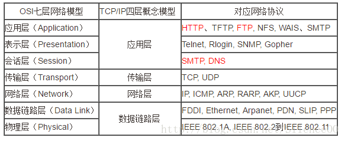
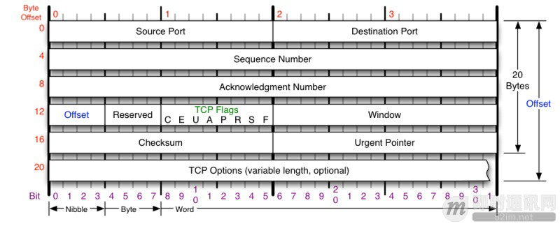

# 网络协议

## 分层(tcp/ip 5层,OSI 7层)：

#### 链路层：实现了hop间的通信协议。PPP、ATM、Ethernet等

> Frame(数据帧)

#### 网络层：IP，路由协议。ARP

> Packet(数据包)

#### 传输层：实现tcp/udp。

> Segment(数据段)
>
> Segment包只有source Port和Destination Port(IP在网络层)。 

- Sequence Number: 序列号;解决乱序问题。
- Acknowledgement Number: ACK。用来确认收到。
- Window(Advertised-Window):滑动窗口。流量控制。
- TCP Flag: 包的类型。SYN,FIN,ACK…[详细](../.././src/image-20190725155505155.png) 

## TCP状态机

​	

- **SYN超时**：server收到SYN返回SYN-ACK后，等待client发送SYN状态时，发送$2^n$(0-4) 秒间隔五次后未收到响应。
- **SYN FLOOD攻击: ** 因为需要63（1+2+…16）秒所以利用该点，无线发送SYN请求。
- **ISN(初始化序列号): **  未避免序号出现重复。系统有模拟时钟，每4微秒+1操作，$2^{32}$秒归0。
- **MSL(maxium segment lifecycle)**:当小于$2^{32}$秒时就不会出现重复序号。

## TCP重传机制

> tcp协议未保证数据到达。主要两种

### DupAck 重传

- **快速重传(fast retransmit)**：sender收到相同包三次ack，直接重传。	

- **SACK(selective Acknowlegement)** 因未包到达无顺序，ACK中带上后SN后已经收到的。

  > **D-SACK（Duplicate SACK）**
  >
  > 意义：使sender知道如下：
  >
  > > 1. 知道是不是丢包。
  > > 2. 检查timeout时间是否过小。
  > > 3. 包被网络复制。
  > > 4. 网络出现`reordering`。

  

### 超时重传 （timeout retransmit）

​      **RTT（Round Trip Time）：**发出的时间计时t0，接收到ACK计时t1；rtt=t1-t0。

​      **RTO(Retransmission Time Out)**：加权移动算法（经典，Jacobson / Karels 算法 常用）

>RTO计算算法:
	>- 1）首先，先采样RTT，记下最近好几次的RTT值。
	>- 2）然后做平滑计算SRTT（ Smoothed RTT），公式为：（其中的 α 取值在0.8 到 0.9之间，这个算法英文叫Exponential weighted moving average，中文叫：加权移动平均）
	>  SRTT = ( α * SRTT ) + ((1- α) * RTT)
	> - 3）开始计算RTO。公式如下：
	>  RTO = min [ UBOUND,  max [ LBOUND,   (β * SRTT) ]  ]
	> 1. UBOUND是最大的timeout时间，上限值
	> 2.  LBOUND是最小的timeout时间，下限值
	>
	> β 值一般在1.3到2.0之间。
	>
	>### Karn / Partridge 算法：
	> 
	>​	忽略重传。
	> 
	>### jacobson/karels 算法：
	>
	>- SRTT = SRTT + α (RTT – SRTT) ：计算平滑RTT；
	>- DevRTT = (1-β)*DevRTT + β*(|RTT-SRTT|) ：计算平滑RTT和真实的差距（加权移动平均）；
	>- RTO= μ * SRTT + ∂ *DevRTT ： 神一样的公式。
	>
	>
	>（其中：在Linux下，α = 0.125，β = 0.25， μ = 1，∂ = 4）参数未调教出来的。

### 拥堵控制（congestion control）

**congestion window（cwnd）**

> 类似slidewindow。区别：由sender 维护。通过控制cwnd控制流量发送快慢。

**控制的四个阶段的算法**

1. 慢启动（slow start）。最初状态
2. 拥塞避免（congestion avoidance）。当cwnd >= ssthresh（slow start threshod）时，进入该状态。
3. 拥塞发生（fast retransmit）。当出现RTO超时，sshthresh=cwnd/2进入慢启动过程。`fast retransmit`重复3个ACK时，进入Fast-Recovery算法。
4. 快速恢复。

> 四个算法通过是否丢包、是否超时判断在哪个阶段，今儿选择响应的算法。

### 流量控制（flow control）
**slide window(advertised window,rwnd)**

> receiver维护。
>
> 作用：流量控制手段之一。TCP头里有一个字段叫Window，又叫Advertised-Window，这个字段是接收端告诉发送端自己还有多少缓冲区可以接收数据。于是发送端就可以根据这个接收端的处理能力来发送数据，而不会导致接收端处理不过来。

**zero window：**receiver通知sender，自己窗口为0，停止发送。`ZWP(Zero Window Probe)`：sender 30-60秒间隔发送三次确认，如果依然zero window，则断开链接。

> **只要有等待的地方都可能出现DDoS攻击**，Zero Window也不例外，一些攻击者会在和HTTP建好链发完GET请求后，就把Window设置为0，然后服务端就只能等待进行ZWP，于是攻击者会并发大量的这样的请求，把服务器端的资源耗尽。

**silly window syndrome**:窗口糊涂综合征。reveiver处理不及sender快，导致window size越来越小，发送的包也越来越小。

> 解决算法:[Nagle’s algorithm](http://en.wikipedia.org/wiki/Nagle's_algorithm)。

## 网络帧：

###协议格式: SRC_ADDR | DESC_ADDR | CONTENT_PROTOCOL | CONTENT

>  每个硬件和硬件的传播叫hop，链路层的一次传播为1hop，一次网络层传输可能有多个hop传输。

---

[维基百科-TCP](https://en.wikipedia.org/wiki/Transmission_Control_Protocol#Window_scaling)

[tcp in a nutshell](http://www.cs.miami.edu/home/burt/learning/Csc524.032/notes/tcp_nutshell.html)

[深入理解TCP协议（上）：理论基础](http://www.52im.net/thread-513-1-1.html)
[深入理解TCP协议（下）：理论基础](http://www.52im.net/thread-515-1-1.html)

