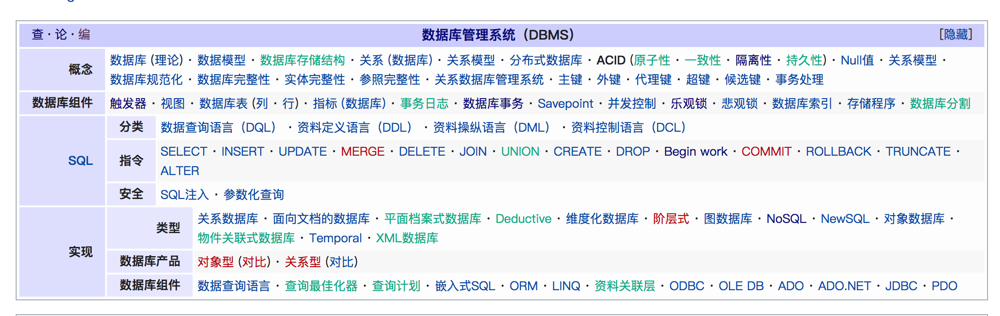

# DBMS

## 事务

### ACID

> 原子性和持久性通过**redo-log**和**undo-log**实现。

#### atom（原子性）

#### consistency（一致性）

 数据库的完整性没有被破坏。这表示写入的资料必须完全符合所有的预设[约束](https://zh.wikipedia.org/wiki/数据完整性)、[触发器](https://zh.wikipedia.org/wiki/触发器_(数据库))、[级联回滚](https://zh.wikipedia.org/wiki/级联回滚)等。

> *级联回滚*(cascading rollback)是指数据库的一个事务的失败引起多个事务随之失败，都要各自回滚

例：银行账户A转到B。A - 500， B+500需要同时完成。

#### isolate（独立性）

数据库允许多个并发事务同时对其数据进行读写和修改的能力，隔离性可以防止多个事务并发执行时由于交叉执行而导致数据的不一致。事务隔离分为不同级别，包括未提交读（Read uncommitted）、提交读（read committed）、可重复读（repeatable read）和串行化（Serializable）

#### durability（持久性）

事务处理结束后，对数据的修改就是永久的，即便系统故障也不会丢失。

-------------

**Data retrieval** means obtaining data from a database management system such as ODBMS. In this case, it is considered that data is represented in a structured way, and there is no ambiguity in data.

