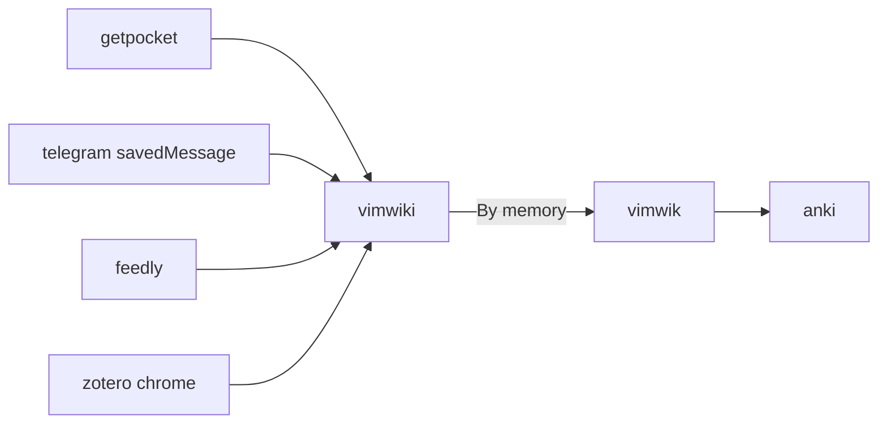

# 非技术相关内容
## note workflow

## task
* [study-gtd](study.md)
* [work-gtd](210315-1513.md)

## principles
* [Principles](210204-1441.md)
* [Main Items](210314-1048.md)

## book
  [投资类书籍](210208-1732.md)
  [摄影网站](210523-2357.md)
